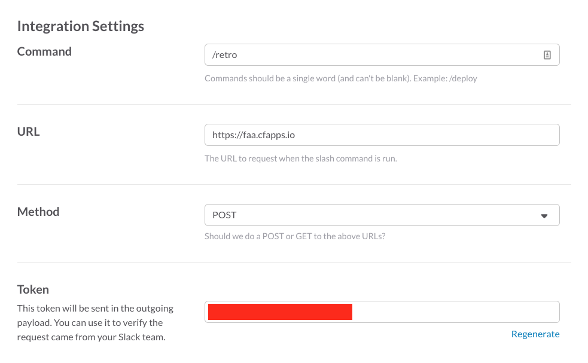

# faa

The simplest Slack retrobot you ever did see

## Deploying

### Slack Integration

FAA must be configured in your Slack as a "Custom Integration". Here's an example of the production integration settings.



Make sure to configure `URL` to the publicly available URL of your Cloud Foundry app (see below)


### Cloud Foundry

FAA runs as an app on Cloud Foundry. To successfully push, you must provide the following:

- `SLACK_VERIFICATION_TOKEN`: *string*, Verification token provided by your slack integration, see "Token" in the slack configuration above
- `POSTFACTO_CONFIG`: configuration of postfacto retros per channel in the following JSON format:

```json
{
  "<SLACK_CHANNEL_ID>": {
    "name: <SLACK_CHANNEL_NAME>,
    "retro_id": <POSTFACTO_RETRO_ID>,
    "password": <POSTFACTO_RETRO_PASSWORD>
  }
}
```

where:
- `<SLACK_CHANNEL_ID>` *string*, The ID of the slack channel where the retro item is being created. If you try using retro bot in slack channel that is not configured you will see the error message that contains current channel ID.
- `<SLACK_CHANNEL_NAME>` *string*, The name of the slack channel where the retro item is being created.
- `<POSTFACTO_RETRO_ID>`, *integer*, The postfacto ID of your retro.
- `<POSTFACTO_RETRO_PASSWORD>`, *string*, The password for your postfacto retro.

Other configuration necessary to run on Cloud Foundry can be found in our [production manifest.yml](manifest.yml)


## Using

Assuming you have configured your slack integration with the command `/retro`

```
/retro [happy/meh/sad/tech] [your message]
```


## Development

- Uses [gvt](github.com/FiloSottile/gvt) for vendoring
- Convenient `./bin/build` script
